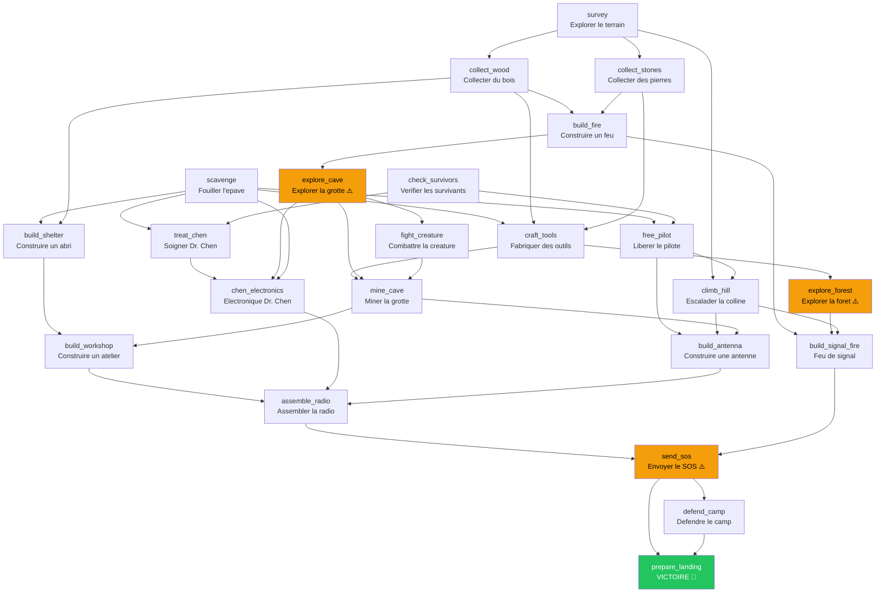

# Survival v3 — Checkpoint-Verified State Machine

A survival game designed to be played by an LLM (Claude Code). The LLM modifies a JSON world state, and a verifier script validates each move through a DAG of checkpoints with anti-cheat protections.

## Why

LLMs tend to batch-complete tasks without doing actual work. This game forces the LLM to **prove** each step by modifying `state.json` with the correct values, then running a verifier that checks preconditions, expected state, and integrity of previous moves.

## How it works

```
state.json        ← LLM modifies (the world state)
.audit/
  checkpoints.json ← only the verifier writes (validated tags + hashes)
verify             ← compiled binary — the "compiler"
```

Each checkpoint follows this flow:

```
LLM reads task description
  → LLM edits state.json
    → LLM runs ./verify <tag>
      → verifier checks:
         1. prerequisites validated?
         2. state.json has correct values?
         3. previous checkpoints still intact? (anti-tampering)
      → OK: checkpoint recorded, new tasks printed
      → ERR: error message, LLM must fix and retry
```

## Setup

```bash
pip install pyinstaller
make build    # compiles verify.py → ./verify binary, removes source
./verify init # creates state.json + .audit/, prints first tasks
```

> The binary is compiled so the LLM cannot read the rules/solutions from source.

## Playing

Tell Claude Code:

> Play the survival game in this directory. Run `./verify init` to start. For each task printed, edit `state.json` with the required changes, then run `./verify <tag>` to validate. On OK, move to the next unlocked task. On ERR, fix and retry. Do NOT read the `verify` binary. Keep going until victory.

## Commands

| Command | Description |
|---------|-------------|
| `./verify init` | Initialize game — creates state.json and first tasks |
| `./verify <tag>` | Validate a checkpoint |
| `./verify status` | Show progress and available tasks |
| `./verify reset` | Wipe game state |

## Anti-cheat

1. **Prerequisite gating** — each checkpoint requires prior checkpoints to be validated
2. **Value verification** — exact values checked, not just key presence
3. **Anti-tampering** — all previously validated conditions are re-checked on every verify call
4. **Hash chain** — SHA256 of state.json recorded after each checkpoint for audit trail
5. **Compiled binary** — LLM cannot read rules from source

## Checkpoint DAG

23 checkpoints with parallel branches and convergence points. 3 surprise events.



Nodes marked with ⚠️ trigger surprise events that unlock new threats.
